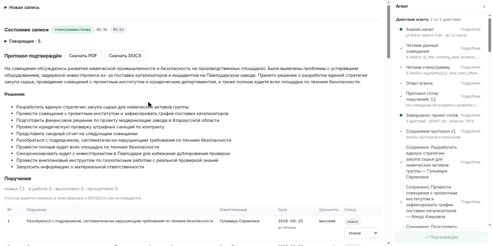
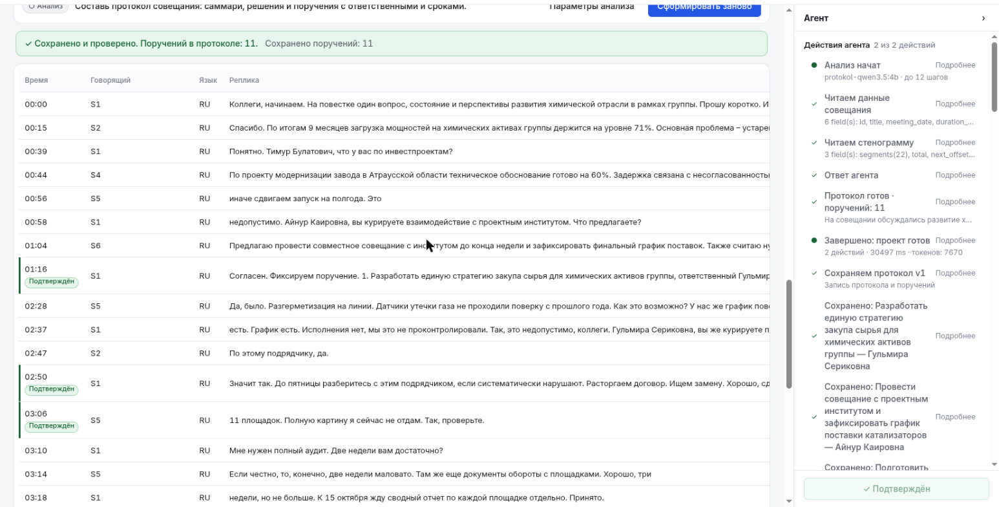
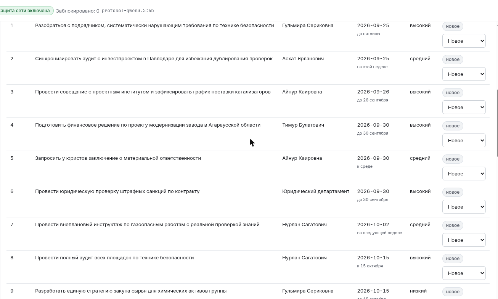

# Protokol

Локальный помощник для секретаря совещания и руководителя: превращает запись встречи в стенограмму с говорящими и проект протокола — саммари, решения, поручения, ответственные и сроки. Каждое поручение связано с фрагментом стенограммы. Человек проверяет проект, подтверждает его и скачивает PDF или DOCX. Аудио и текст обрабатываются на машине пользователя.

## Что реализовано

| Требование | Статус | Проверка |
|---|---|---|
| Распознавание речи | ✅ Загрузка аудио/видео, локальная обработка, таймкоды слов | `tests/speech/test_asr.py`, `POST /api/domain/meetings/{id}/transcribe` |
| Русский язык | ✅ Проверен на двух записях организаторов; остаются ошибки имён | [Аудит](evaluation/organizer/accuracy-summary.md) |
| Казахский язык | ✅ Отдельная дообученная модель Whisper large-v3-turbo для казахского; ограничение: короткие казахские реплики внутри русской речи иногда распознаются как русские (см. разбор смешанной речи) | `tests/speech/test_asr.py`, [разбор смешанной речи](evaluation/mixed-language.md) |
| Смешанная RU/KK-речь | ⚠️ Выбор языка по окнам; переключение внутри предложения не решено | `app/speech/asr.py` |
| Поручения, ответственные, сроки | ✅ Все группы поручений из эталонных протоколов найдены на обеих записях организаторов (10/10 и 6/6); отдельные ошибки содержания перечислены в аудите | `tests/domain/test_service.py`, [аудит](evaluation/organizer/accuracy-summary.md) |
| Диаризация и привязка к людям | ✅ Говорящие разделены, каждое поручение привязано к говорящему (owner_speaker_id) и к цитате из стенограммы (source_segment_ids); имена говорящих задаются в интерфейсе, автоматической идентификации по голосу нет | `tests/speech/test_diarize.py`, `tests/speech/test_align.py` |
| PDF/DOCX | ✅ Экспорт подтверждённого протокола с кириллицей, таблицей и стенограммой | `tests/domain/test_exports.py`, [Docker-проверка](evaluation/docker-smoke.json) |

Пути `app/` и `tests/` в таблице относятся к `backend/`. Статусы поручений в интерфейсе сохраняются только в текущем браузере и не изменяют PDF/DOCX.

### Скриншоты

01 — Подтверждённый протокол с кнопками экспорта PDF и DOCX.



02 — Стенограмма с подтверждающими фрагментами и шагами агента.



03 — Доска статусов поручений с индикатором локальной работы и сетевой защиты.



## Как это работает

```text
Запись → ffmpeg, 16 kHz mono → Silero VAD → определение языка окна
       → RU/EN Whisper turbo или Kazakh Whisper → таймкоды слов
       → диаризация на CPU → совмещение слов и говорящих → PostgreSQL
       → инструменты get_meeting / read_transcript → проект протокола
       → проверка цитат и сроков → подтверждение человеком → PDF / DOCX
```

В режиме Qwen агент читает встречу и стенограмму через инструменты, затем возвращает структурированный JSON. Сервер проверяет, что цитаты принадлежат встрече и прочитаны в текущем запуске, сверяет метки говорящих и рассчитывает распознанные относительные сроки от даты встречи. Это не доказывает смысловую правильность каждого поля — проект требует просмотра.

Трассировка SDK отключена. Модели речи открываются только с локального диска. Защита исходящих соединений и счётчик блокировок отображаются в `/api/health`. Это прикладная защита Python, а не независимый сетевой аудит; соединение с локальной базой Docker необходимо для работы приложения.

## Технологии и модели

| Компонент | Назначение / размер на диске | Лицензия и источник |
|---|---|---|
| `deepdml/faster-whisper-large-v3-turbo-ct2` | RU/EN ASR, около 1,6 GiB | [MIT](https://huggingface.co/deepdml/faster-whisper-large-v3-turbo-ct2) |
| `shyngys879/kazakh-whisper-large-v3-turbo`, локальный CT2 | Казахский ASR, около 782 MiB | [Apache-2.0](https://huggingface.co/shyngys879/kazakh-whisper-large-v3-turbo) |
| pyannote segmentation-3.0 ONNX | Сегментация голосов; вместе с ERes2Net около 46 MiB | [MIT, веса](https://huggingface.co/pyannote/segmentation-3.0) |
| 3D-Speaker ERes2Net ONNX | Представления голосов и кластеризация | [Apache-2.0](https://github.com/modelscope/3D-Speaker/blob/main/LICENSE) |
| Silero VAD ONNX | Детектор речи, около 632 KiB | [MIT](https://github.com/snakers4/silero-vad/blob/master/LICENSE) |
| Qwen3.5-4B через Ollama | Живое извлечение протокола, 3,4 GB | [Apache-2.0](https://huggingface.co/Qwen/Qwen3.5-4B) |
| Qwen3-4B-Instruct-2507 Q4_K_M | Дополнительный локальный вариант, 2,5 GB | [Apache-2.0](https://huggingface.co/Qwen/Qwen3-4B-Instruct-2507) |

`backend/scripts/get_models.sh` получает RU-модель с Hugging Face, VAD и ONNX-модели диаризации из публичных релизов sherpa-onnx. Казахский каталог CT2 предоставляется отдельно: скрипт его не скачивает и не конвертирует. Веса не входят в Git. Лицензия весов pyannote — MIT; среды sherpa-onnx — Apache-2.0.

Основные библиотеки: Python 3.12 (PSF); FastAPI, Pydantic, OpenAI Agents SDK, faster-whisper, CTranslate2, ONNX Runtime, SQLAlchemy, Alembic, python-docx (MIT); asyncpg и sherpa-onnx (Apache-2.0); ReportLab (BSD); React и Vite (MIT), TypeScript (Apache-2.0). PostgreSQL — PostgreSQL License, Ollama — MIT. Лицензия ffmpeg зависит от сборки (LGPL/GPL). Шрифты DejaVu и их уведомление находятся в `backend/app/domain/fonts/`. Код Protokol — [MIT](LICENSE); лицензии моделей и зависимостей действуют отдельно. Версии закреплены в `backend/uv.lock` и `frontend/pnpm-lock.yaml`.

## Архитектура

FastAPI обслуживает загрузку, обработку и экспорт; PostgreSQL хранит встречи, сегменты, говорящих, проекты и подтверждения. React показывает запись, стенограмму, доказательства и результат. `DomainModule` связывает обработку встреч с исполнением агента, а `DomainAdapter` — данные протокола с интерфейсом. Подробности: [архитектура](docs/ARCHITECTURE.md), [API](docs/API.md), [локальный Qwen](docs/LOCAL_LLM.md).

## Установка и запуск

Два пути: **Docker — воспроизводимая демонстрация без LLM; dev — живой локальный Qwen**. В обоих распознавание аудио настоящее и требует весов речи. LLM-путь требует Ollama на хосте и не контейнеризирован.

### Веса речи

Скопируйте предоставленный комплект весов в `backend/models/`:

```text
backend/models/
  ru-turbo-ct2/       model.bin, config.json, tokenizer.json,
                     preprocessor_config.json, vocabulary.json
  kk-turbo-ct2/       те же пять файлов
  vad/silero_vad.onnx
  diarization/sherpa-onnx-pyannote-segmentation-3-0/model.onnx
  diarization/3dspeaker_speech_eres2net_base_sv_zh-cn_3dspeaker_16k.onnx
```

Комплект занимает около 2,4 GiB. Если уже есть казахский CT2-каталог, остальные публичные веса можно установить через `make install models` (нужны `uv`, Python 3.12 и интернет). Подготовленные модели при обработке сеть не используют. Без казахского каталога `make models` завершится с объяснением; одного клонирования Git для ASR недостаточно.

### Docker: без Ollama

Нужны Docker Engine с Compose, `make`, `curl`, свободные порты 5433 и 8080. Для CLI-проверки нужны Bash, `jq` и `od` (coreutils). При первой сборке скачиваются образы и зависимости; требуется место для весов и Python/CUDA-библиотек, даже при CPU-обработке.

```bash
cp .env.example .env
mkdir -p backend/media
# До запуска разместите веса речи в backend/models/.
OPENAI_MODEL=scripted:auto make stack
curl -fsS http://localhost:8080/api/health
```

Откройте `http://localhost:8080/#/app`. Ожидается `model: scripted:auto`, `models_present: true`, `provenance.enabled: true`. Compose монтирует локальные `models`, `media`, `samples`; ASR работает на CPU. Адрес `http://localhost:11434/v1` нужен для проверки конфигурации при запуске; scripted-режим к нему не обращается. Явное значение `OPENAI_MODEL` исключает влияние настроек оболочки. Создание `backend/media` до запуска контейнера сохраняет права текущего пользователя для файлов CLI-проверки.

### Dev: локальный Qwen

Нужны Python 3.12, `uv`, Node 22.13+, `pnpm`, ffmpeg, Docker для PostgreSQL и Ollama на этой же машине. Установите в Ollama `qwen3.5:4b`, затем:

```bash
make install
cd frontend && pnpm install --frozen-lockfile && cd ..
make demo
make llm
OPENAI_MODEL=protokol-qwen3.5:4b make api
# В другом терминале:
make web
```

Откройте `http://localhost:5173/#/app`. `make llm` создаёт локальное имя `protokol-qwen3.5:4b` с контекстом 16 384 токена, переиспользуя установленные веса. Если исходной модели ещё нет: `ollama pull qwen3.5:4b` (загрузка весов, не передача аудио или текста). Подробности — в [LOCAL_LLM.md](docs/LOCAL_LLM.md).

`STT_DEVICE=auto` выбирает CUDA при наличии, иначе CPU; для явного выбора задайте `STT_DEVICE=cpu` или `STT_DEVICE=cuda` перед `make api`. CPU использует int8. На машине с 6 GB VRAM ASR и LLM обрабатываются последовательно.

## Как проверить

### Сначала: демонстрация без языковой модели

1. Запустите Docker-командой выше; Ollama не нужен.
2. Откройте `http://localhost:8080/#/app` → «Новая запись», выберите `backend/samples/sovechanie_2.mp3`, укажите название и дату `2026-09-23`, нажмите «Загрузить».
3. Нажмите «Транскрибировать» и дождитесь готовности. На проверенной машине CPU занял **472 секунды (7 мин 52 с)**. Проверьте стенограмму; при необходимости задайте имена в разделе «Говорящие» до формирования проекта.
4. Нажмите «Сформировать протокол», просмотрите цитаты, затем «Подтвердить протокол» → «Скачать PDF» или «Скачать DOCX».

Scripted-режим выбирает не более трёх цитат с распознанным сроком, без LLM. В проверенном Docker-прогоне записи №2 получилась **одна** строка, статус `verified`, PDF на две страницы. Это проверка всей цепочки, но не полноты извлечения Qwen. [Результаты](evaluation/docker-smoke.json).

CLI-эквивалент загружает новую запись, не сбрасывая существующие встречи:

```bash
API=http://localhost:8080 make smoke
```

Ответы, времена, PDF и DOCX сохраняются под `backend/media/verification/`. Отдельные `curl`-запросы — в [API.md](docs/API.md).

### Затем: живая модель

Выполните `make llm`, запустите dev API с `OPENAI_MODEL=protokol-qwen3.5:4b`, проверьте `/api/health` на порту 8000 и повторите шаги в интерфейсе на 5173. CLI: `API=http://localhost:8000 make smoke`. Проверенный Qwen-прогон записи №1 сформировал 11 строк за 30,5 секунды после готовой стенограммы. Сохранены оба состояния одного запуска: [JSON предложения](evaluation/organizer/qwen-live-verified.json) содержит `detail.run.status = proposed` (имя файла не означает подтверждение), а [полный RunDetail после подтверждения](evaluation/organizer/results/qwen-live-confirmed.json), повторно полученный через API после восстановления исходной БД, содержит `run.status = verified`, `application.status = verified` и проверки сохранения в `application.verification`. Предложение используется для оценки извлечения; второй файл подтверждает применение. Файлы этого подтверждённого запуска: [PDF](evaluation/organizer/results/qwen-live-protocol.pdf) и [DOCX](evaluation/organizer/results/qwen-live-protocol.docx). Экспорт дополнительно проверен в Docker-сценарии выше. Число строк может меняться при новом запуске.

Ручная оценка двух организаторских записей: **10/10 и 6/6 групп поручений имеют соответствие**, создано **11 и 8 строк**. Это покрытие групп, не «100% точность»: ошибки перечислены в [accuracy-summary.md](evaluation/organizer/accuracy-summary.md).

```bash
python3 evaluation/organizer/check_samples.py --source-dir evaluation/organizer/source
```

Проверка исходников дала `PASS` для обеих записей: четыре размера/SHA-256 совпали, **10 и 6 групп** совпали с таблицами DOCX. Она проверяет происхождение файлов и эталонные строки, а не качество ASR/Qwen. Исходные протоколы не подаются модели.

Для записи №1 длительностью **274,25 с** речевой конвейер занял **86,726 с на GPU (≈87 с)** и **522,162 с на CPU (≈522 с)**. GPU — RTX 3060 Laptop 6 GB; CPU — Ryzen 5 5600H. Время включает загрузку моделей, VAD, ASR, диаризацию и совмещение, исключает генерацию протокола, БД и экспорт. Диаризация всегда на CPU. [Измерения](evaluation/performance/summary.json).

```bash
cd backend
uv run pytest -q
uv run ruff check .
cd ../frontend
pnpm lint
pnpm build
```

Последняя проверка backend: **199 passed**; Ruff и ESLint чистые. Предыдущий прогон дал 222 passed; после удаления Docker-подключения к LLM удалены и 23 соответствующие проверки. Тестам API нужна PostgreSQL на 5433 (отдельная `agent_workspace_test`); тесты с маркером `models` требуют локальных весов и без них пропускаются. Проверка без ASR: `uv run pytest -q -m 'not models'`.

### Проверка чистого клона — выполнена

23 сентября проверен коммит `94f6888` в `/tmp/protokol-check`: отдельный Docker-проект `protokol-check`, новая база `protokol-check_pgdata`, скопированные локальные веса. `make stack` завершился успешно; health показал `scripted:auto`, `models_present: true`, включённую защиту и ноль блокировок. Новый smoke-скрипт загрузил запись №2, распознал её за **455 секунд**, подтвердил одно поручение (`verified`) и скачал PDF (54 281 байт, 2 страницы) и DOCX (39 681 байт, корректный архив). Затем `git pull --rebase`, `pnpm install --frozen-lockfile`, `pnpm build` и `pnpm lint` прошли в клоне. Это полный прогон из чистого checkout и новой БД; веса и кэш Docker были локальными.

При повторной проверке на той же машине сначала остановите первый стек командой `docker compose --profile app down` (без удаления томов): контейнеры и порты двух экземпляров совпадают. Из чистого клона с размещёнными весами выполните:

```bash
cp .env.example .env
mkdir -p backend/media
COMPOSE_PROJECT_NAME=protokol-check OPENAI_MODEL=scripted:auto make stack
API=http://localhost:8080 make smoke
```

## Данные и интеграции

Записи `sovechanie_1.mp3` и `sovechanie_2.mp3` предоставлены организаторами. Два смешанных RU/KK/EN-файла записаны командой. Загруженные записи остаются в `backend/media/`, результаты — в локальной PostgreSQL. Облачных API для аудио и текста нет; СЭД, почта, Teams и Zoom не подключены. Установка зависимостей и публичных весов требует интернета, обработка — нет. `blocked_external_connections: 0` означает отсутствие зарегистрированных блокировок, а не доказательство отсутствия любого сетевого трафика.

## Ограничения

- При аудите обнаружены **один неверный исполнитель, один дубликат, искажённые распознаванием имена, некоторые цитаты на другое высказывание и пропущенное позднее изменение срока**. Проект требует проверки этих полей.
- Короткие казахские реплики иногда маршрутизируются в русскую модель; возможна потеря регистра и пунктуации. Переключение языка внутри фразы и наложение голосов обрабатываются ненадёжно.
- Диаризация пакетная, не потоковая; возможны объединённые реплики и лишние метки. Имена говорящих появляются только после ручного переименования в UI. Ответственный из поручения не используется для автоматического называния голоса.
- Сроки считаются от указанной даты встречи. Для формулировок только с неделей используется соглашение о пятнице; неразобранная дата остаётся пустой. Позднее уточнение не всегда заменяет ранний срок.
- У 4B-модели ограничен контекст; длинная встреча может не поместиться. Повреждённый JSON отклоняется. Приложение формирует проект, а не юридически выверенный итог.
- Статусы поручений локальны для браузера. Редактирование поручений через API и совместные статусы не реализованы. Подтверждённая запись защищена от повторной транскрипции.
- WER и DER не заявляются: нет вручную проверенной временной разметки, а протоколы организаторов местами расходятся с записью. Приложение проверено как локальная демонстрация, без многопользовательской авторизации.

## Дорожная карта

Улучшить сохранение финальных сроков, устранение повторов и смысловую проверку цитат; собрать размеченный набор казахской и смешанной речи; добавить серверные статусы и редактирование поручений. Следующие интеграции: СЭД, напоминания и рассылка ответственным, голосовая идентификация с согласия участников, Teams/Zoom. Эти функции пока не реализованы.
